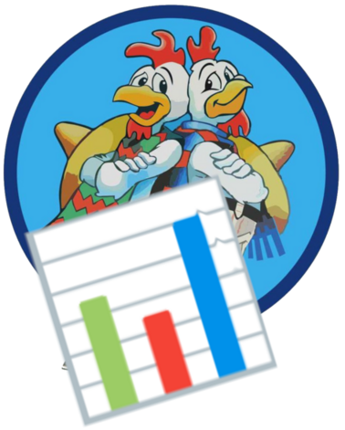

# El Pollo Hermano

El Pollo Hermano is a polling application that has absolutely no added value. It's only purpose is educational. For me.

What I want to do with that:

1. Define a minimalistic product vision (I might write it here, I might not)
2. Implement it using technologies I know nothing about, doing my best to do the right thing rather than just "making it work" (so you're very likely to see tests in there)
3. Learn from my failures and mistakes

Everything is at the same place for simplicity reason. Don't do that at home, and ABSOLUTELY NEVER DO THAT at work.

The software is released with the [WTFPL](LICENCE), which means you can do anything you want with the code. 

It don't own the rights for the chicken logo, please get in touch if you own them and don't like me using it.

Cheers
